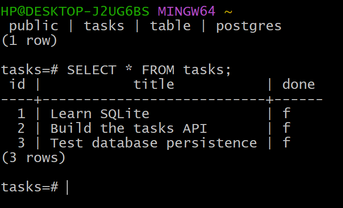
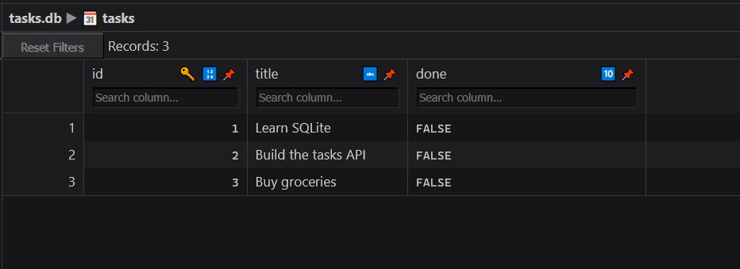
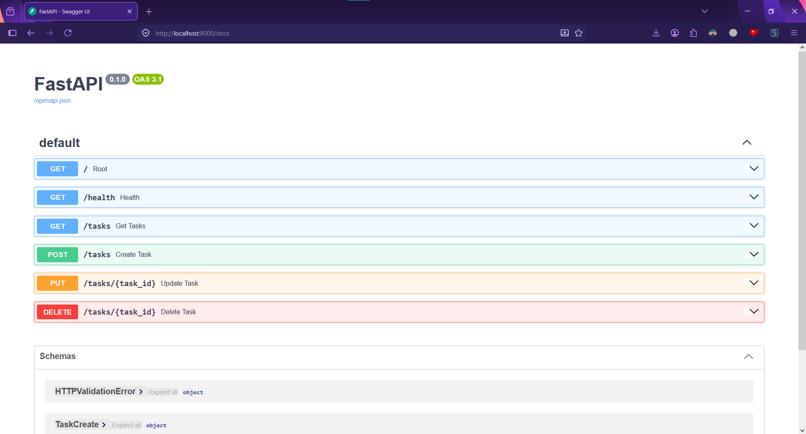

# Task API - To-Do List CRUD Service

A lightweight RESTful API built with FastAPI for managing a simple to-do list with full CRUD operations.

## Table of Contents

- [Overview](#overview)
- [Features](#features)
- [Tech Stack](#tech-stack)
- [Database](#database)
- [Installation](#installation)
- [Running the Application](#running-the-application)
- [API Endpoints](#api-endpoints)
- [Request/Response Examples](#requestresponse-examples)
- [Swagger UI Documentation](#swagger-ui-documentation)
- [Error Handling](#error-handling)
- [Testing with Swagger UI](#testing-with-swagger-ui)
- [Project Structure](#project-structure)
- [Contributing](#contributing)
- [License](#license)

## Overview

This Task API provides a simple interface for managing tasks. Each task has an ID, title, and completion status. The API uses SQLite for persistent storage and supports all CRUD operations.

## Features

- Create new tasks with a title
- Retrieve all tasks
- Update task title and/or completion status
- Delete tasks by ID
- Automatic validation for empty titles
- Detailed error responses
- Auto-generated interactive API documentation (Swagger UI)
- Health check endpoint

## Tech Stack

- **Python 3.07+**
- **FastAPI** - Web framework
- **Pydantic** - Data validation
- **Uvicorn** - ASGI server
- **SQLite** - Lightweight persistent database

## Database with SQLite(OLD)

SQLite was chosen because it is a lightweight database that:

- Uses a single database file
- Requires zero separate database-server setup
- Persists data across server restarts

The database file is `tasks.db`. It is created automatically by the application when needed. The file is usually added to `.gitignore`, so each clone of the project starts with a fresh database instead of sharing another developer's local data.

## Database
`docker compose up --build`


## Installation

### Prerequisites

- Python 3.7 or higher
- pip (Python package manager)

### Steps

1. **Clone the repository**
```bash
git clone https://github.com/MiaBurhan/first-CRUD-API.git
cd first-CRUD-API
```

2. **Copy the env file**
```
cp .env.example .env
```

## Running the Application

### Start the Project
```
docker compose up --build
```

Run this command from the project directory:

The server will start at: `http://localhost:8000`

### Access the API
- **Base URL**: `http://localhost:8000`
- **Interactive API Docs**: `http://localhost:8000/docs`
- **Alternative API Docs**: `http://localhost:8000/redoc`

## API Endpoints

| Method | Endpoint | Description | Request Body | Success Response |
|--------|----------|--------------|----------------|-------------------|
| GET | `/tasks` | Get all tasks | — | `200 OK` — array of tasks |
| GET | `/tasks/{id}` | Get a single task by id | — | `200 OK` — task object |
| POST | `/tasks` | Create a new task | `{"title": "string", "done": false}` | `201 Created` (or `200`) — created task with `id` |
| PUT | `/tasks/{id}` | Update an existing task | `{"title": "string", "done": true}` | `200 OK` — updated task |
| DELETE | `/tasks/{id}` | Delete a task by id | — | `200 OK` / `204 No Content` |

# All CRUD operations commands
## Create (POST)

**bash:**
```bash
curl -i -X POST http://localhost:8000/tasks \
  -H "Content-Type: application/json" \
  -d '{"title":"Test task","done":false}'
```

**cmd:**
```cmd
curl -i -X POST http://localhost:8000/tasks -H "Content-Type: application/json" -d "{\"title\":\"Test task\",\"done\":false}"
```

## Read all (GET)

**bash:**
```bash
curl -i http://localhost:8000/tasks
```

**cmd:**
```cmd
curl -i http://localhost:8000/tasks
```

## Read one (GET by id)

**bash:**
```bash
curl -i http://localhost:8000/tasks/1
```

**cmd:**
```cmd
curl -i http://localhost:8000/tasks/1
```

## Update (PUT)

**bash:**
```bash
curl -i -X PUT http://localhost:8000/tasks/1 \
  -H "Content-Type: application/json" \
  -d '{"title":"Updated task","done":true}'
```

**cmd:**
```cmd
curl -i -X PUT http://localhost:8000/tasks/1 -H "Content-Type: application/json" -d "{\"title\":\"Updated task\",\"done\":true}"
```

## Delete

**bash:**
```bash
curl -i -X DELETE http://localhost:8000/tasks/1
```

**cmd:**
```cmd
curl -i -X DELETE http://localhost:8000/tasks/1
```

Replace `1` with whatever real id you're testing against — always check with **GET all** first to confirm it exists.
## New Database example by psql

**How to get the database by psql**
```bash
docker compose exec db psql -U postgres -d tasks
```
**Then Write**
```
\dt
SELECT * FROM tasks;
```

## Database in DB Browser for SQLite(OLD)

The SQLite database can be opened in **DB Browser for SQLite** to inspect the `tasks.db` file and its tables.



*Database screenshot: `tasks.db` opened in DB Browser for SQLite.*

> If your screenshot has a different filename, change `task_pic.png` above to match the actual file name in the repository.

## Swagger UI Documentation

The API comes with automatically generated interactive Swagger UI documentation, making it easy to explore and test all endpoints.

### Screenshot of the Swagger UI


*The main Swagger UI page showing all available endpoints*


### How to Access Swagger UI

1. Start the server
2. Open your browser and navigate to: `http://localhost:8000/docs`
3. You'll see an interactive documentation page
4. Click on any endpoint to expand it and view details
5. Use the "Try it out" button to test endpoints directly

## Error Handling

The API returns appropriate HTTP status codes with descriptive error messages:

### 400 Bad Request
- When title is missing or empty (POST request)
- When request body is empty (PUT request)
- When title is empty in update (PUT request)

**Example Response:**
```json
{
  "detail": "title is required and cannot be empty"
}
```

### 404 Not Found
- When trying to update or delete a task with a non-existent ID

**Example Response:**
```json
{
  "detail": "Task not found"
}
```

## Testing with Swagger UI

FastAPI automatically generates interactive API documentation. To test the API:

1. Start the server
2. Navigate to `http://localhost:8000/docs`
3. Click on any endpoint to expand it
4. Click "Try it out"
5. Fill in the parameters or request body
6. Click "Execute" to send the request
7. View the response directly in the browser

## Project Structure

```
first-CRUD-API/
├── main.py             # This file handles web stuff
├── models.py           # Just shapes/definitions
├── psql_db_pic.png     # Database pic taken by psql
├── README.md           # Documentation
├── requirements.txt    # It contain all the dependencies
├── storage.py          # Place that touches the actual data
├── Swagger_UI.png      # Swagger UI screenshot
├── task_pic.png        # SQLite database screenshot


```

## License  

This project is open source 
